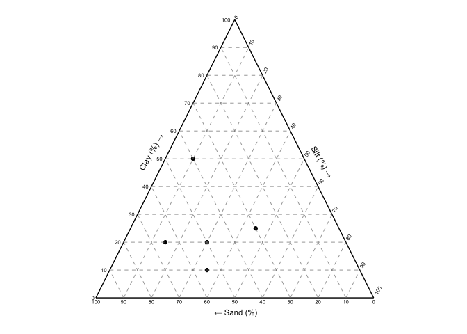
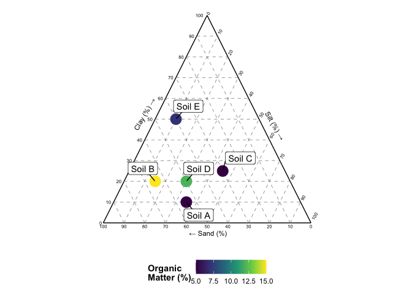

ggsoiltexture
================

The goal of ggsoiltexture is to provide a simple ggplot function for the
plotting of soil textural data. It is still in development and under
review in a journal for publication. Meanwhile, if you use this package
please cite this repository. Hope it is useful!

## Acknowledgements

The code was development based on the ggplot_piper functions written by
[Jonh Dorian](https://gist.github.com/johnDorian/5561272) and inspired
by the R package [ggtern](https://github.com/nicholasehamilton/ggtern).
Thanks for sharing your knowledge. Also, thanks for the X users that
give us feedback about functionalities and new ideas.

## Installation

You can install the last version of ggsoiltexture from
[GitHub](https://github.com/Saryace/ggsoiltexture). This package will be
available in CRAN after publication in a journal.

``` r
# install.packages("devtools")
# devtools::install_github("Saryace/ggsoiltexture")
```

## Main function: ggsoiltexture

You can plot a simple soil textural triangle directly:

``` r
library(tidyverse)
```

    ## ── Attaching core tidyverse packages ──────────────────────── tidyverse 2.0.0 ──
    ## ✔ dplyr     1.1.4     ✔ readr     2.1.5
    ## ✔ forcats   1.0.0     ✔ stringr   1.5.1
    ## ✔ ggplot2   3.5.1     ✔ tibble    3.2.1
    ## ✔ lubridate 1.9.3     ✔ tidyr     1.3.1
    ## ✔ purrr     1.0.2     
    ## ── Conflicts ────────────────────────────────────────── tidyverse_conflicts() ──
    ## ✖ dplyr::filter() masks stats::filter()
    ## ✖ dplyr::lag()    masks stats::lag()
    ## ℹ Use the conflicted package (<http://conflicted.r-lib.org/>) to force all conflicts to become errors

``` r
library(ggsoiltexture)
some_data <- data.frame(id = c("Soil A","Soil B","Soil C","Soil D","Soil E"),
                          clay = c(10,20,25,20,50),
                          silt  = c(35,15,45,30,10),
                          sand = c(55,65,30,50,40),
                          om = c(5,15,5,12,7))

ggsoiltexture(some_data)
```

<!-- -->

Also, it is posible to remove the grid:

``` r
ggsoiltexture(some_data,
              show_grid = FALSE)
```

<!-- -->

Because this function is based on ggplot, you can use ggplot2
functionalities and other packages

``` r
library(ggrepel)
pub_plot <-
    ggsoiltexture(some_data) +
    geom_point(aes(color = om), size = 6) +
    scale_color_continuous(type = "viridis") +
    labs(color = "Organic\nMatter (%)") +
    geom_label_repel(aes(label = id), box.padding = 0.5) +
    theme(legend.title = element_text(face = "bold"),
          legend.position = "bottom")

pub_plot
```

<!-- -->

ggsoiltexture includes some classification systems from USDA, New
Zeland, Germany and Swiss.

``` r
ggsoiltexture(some_data,
              show_grid = FALSE,
              class = "USDA")
```

<!-- -->

The fontsize of the textural class can be changed by the geom_polygon
layer:

``` r
ggsoiltexture(some_data,
              show_grid = FALSE,
              class = "GERMAN")
```

<!-- -->

``` r
ggsoiltexture(some_data,
              show_grid = FALSE,
              class = "NZ")
```

<!-- -->

``` r
ggsoiltexture(some_data,
              show_grid = FALSE,
              class = "SWISS")
```

<!-- -->
