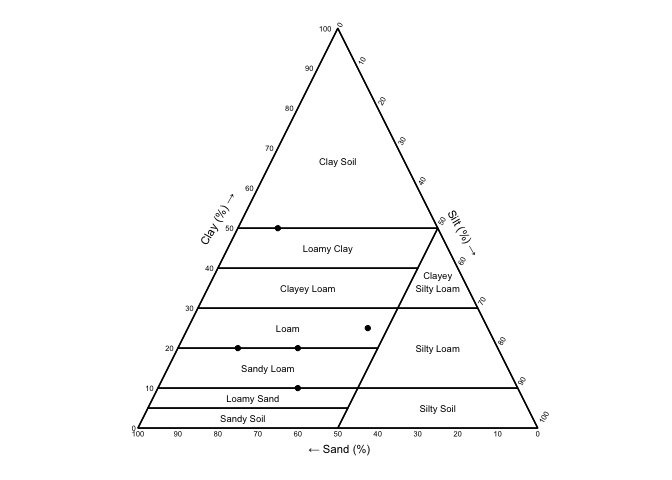
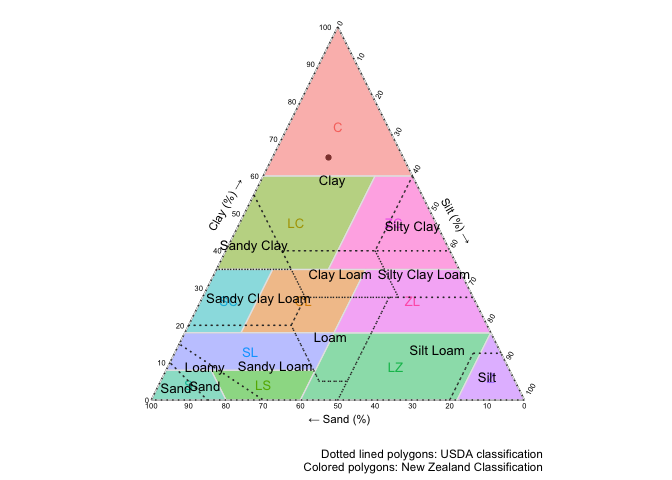

ggsoiltexture
================

The goal of ggsoiltexture is to provide a simple ggplot function for the
plotting of soil textural data. It is still in development and under
review in a journal for publication. Meanwhile, if you use this package
please cite this repository. Hope it is useful!

## Code contributors

Thanks to Moreen, Tom and Lauren for collaborate to improve
ggsoiltexture.

Moreen Willaredt [GitHub Account](https://github.com/MrnWllrdt/) Tom
Bishop [GitHub Account](https://github.com/tombishop1) Lauren O’Brien
[GitHub Account](https://github.com/obrl-soil)

## Acknowledgements

The code was development based on the ggplot_piper functions written by
[Jonh Dorian](https://gist.github.com/johnDorian/5561272) and inspired
by the R package [ggtern](https://github.com/nicholasehamilton/ggtern).
Thanks for sharing your knowledge. Also, thanks for the X users that
give us feedback about functionalities and new ideas.

## Installation

You can install the last version of ggsoiltexture from
[GitHub](https://github.com/Saryace/ggsoiltexture). This package will be
available in CRAN after publication in a journal.

``` r
# install.packages("devtools")
# devtools::install_github("Saryace/ggsoiltexture")
```

## Main function: ggsoiltexture

You can plot a simple soil textural triangle directly:

``` r
library(tidyverse)
library(ggsoiltexture)
some_data <- tibble(id = c("Soil A","Soil B","Soil C","Soil D","Soil E"),
                          clay = c(10,20,25,20,50),
                          silt  = c(35,15,45,30,10),
                          sand = c(55,65,30,50,40),
                          om = c(5,15,5,12,7))

ggsoiltexture(some_data)
```

<!-- -->

Also, it is possible to remove the grid:

``` r
ggsoiltexture(some_data,
              show_grid = FALSE)
```

<!-- -->

Because this function is based on ggplot, you can use ggplot2
functionalities and other packages

``` r
library(ggrepel)
pub_plot <-
    ggsoiltexture(some_data) +
    geom_point(aes(color = om), size = 6) +
    scale_color_continuous(type = "viridis") +
    labs(color = "Organic\nMatter (%)") +
    geom_label_repel(aes(label = id), box.padding = 0.5) +
    theme(legend.title = element_text(face = "bold"),
          legend.position = "bottom")

pub_plot
```

<!-- -->

## Adding classification classes

ggsoiltexture includes some classification systems from USDA, New
Zealand, Germany and Swiss.

``` r
ggsoiltexture(some_data,
              show_grid = FALSE,
              class = "USDA")
```

<!-- -->

``` r
ggsoiltexture(some_data,
              show_grid = FALSE,
              class = "GERMAN")
```

<!-- -->

``` r
ggsoiltexture(some_data,
              show_grid = FALSE,
              class = "NZ")
```

<!-- -->

``` r
ggsoiltexture(some_data,
              show_grid = FALSE,
              class = "SWISS")
```

<!-- -->

``` r
ggsoiltexture(some_data,
              show_grid = FALSE,
              class = "SSEW")
```

<!-- -->

# Some examples

## Comparing two classification systems.

The package has the polygon data for each type of classification, so
they can be used separately for more advanced plotting. Due to the
amount of information, it is recommended to remove all legends and add a
description of the figure.

``` r
data("nz_polygons")
data("usda_polygons")

ggsoiltexture(tibble(sand = 20,
                     silt = 15,
                     clay = 65),
              show_grid = FALSE,
              class = NULL) +
  geom_polygon(data = nz_polygons, 
               aes(x = x, y = y, fill = label),
               alpha = .5,
               color = "grey90") +
  geom_text(data = nz_polygons %>%
              dplyr::group_by(CODE) %>%
              dplyr::summarise_if(is.numeric, mean, na.rm = TRUE),
            aes(label = CODE, color = CODE),
            show.legend=FALSE,
            size = 3.5) +
  geom_polygon(data = usda_polygons, 
               aes(x = x, y = y, fill = label),
               alpha = 0,
               linetype="dotted",
               color = "grey20") +
  geom_text(data = usda_polygons %>%
              dplyr::group_by(label) %>%
              dplyr::summarise_if(is.numeric, mean, na.rm = TRUE),
            aes(label = label),
            size = 3.5) +
  guides(color = "none", fill = "none") +
  labs(caption = "Dotted lined polygons: USDA classification\nColored polygons: New Zealand Classification")
```

<!-- -->

## Using Munsell colors

Munsell colors are widely used for soil classification. Using the
library ´munsell´ the color can be transformed to hexcolor and be
plotted.

``` r
library(munsell)
library(ggrepel)
munsell_data <- tibble(sand = c(45,60,30,50,70,40,55,65,35,25,80,20),
                       clay = c(20,15,25,28,10,30,22,12,58,35,8,70),
                       silt = 100 - sand - clay,
                       om = c(2.3,1.8,3.2,2.0,1.5,2.6,2.8,1.2,3.0,4.0,1.0,4.2),
                       om_level = ifelse(om > 2, "high", "low"),
                       munsell = c("10YR 3/4","7.5YR 4/6","7.5YR 4/6", "10YR 4/2","5YR 3/6",
                                   "10YR 5/8","7.5YR 5/4","2.5Y 4/2","10YR 6/6",
                                   "5YR 4/8","7.5YR 6/2", "10YR 7/4"))

munsell_data$color_hex <- mnsl(munsell_data$munsell)

plot_munsell <- 
ggsoiltexture(munsell_data) +
  scale_color_identity() +
  geom_point(aes(color = color_hex, size = om, group = om_level)) +
  geom_label_repel(aes(label = munsell), box.padding = 0.5) 

plot_munsell
```

<!-- -->

Even it is possible to facet them, due to is based on ggplot :)

``` r
plot_munsell +
  facet_wrap(vars(om_level))
```

<!-- -->

## Cats

Because of cats. This example is just for motivate to the
ggsoiltexture’s users to explore any idea and try to plot it.

``` r
library(ggcats)
```

    ## ~~ Package ggcats
    ## Visit https://r-coder.com/ for R tutorials ~~

``` r
library(gganimate)

ggsoiltexture(tibble(sand = c(90, 30, 50, 0, 50),
                     silt = c(5, 30, 30, 33, 10),
                     clay = c(5, 40, 20, 67, 40)),
              class = NULL) +
  geom_cat(aes(cat = sand), cat = "shironeko", size = 6) +
   transition_reveal(sand)
```

<!-- -->

# How to contribute

We welcome any issues and pull requests.

Please report any bugs you find by submitting an issue on
github.com/Saryace/ggsoiltexture/issues.

If you wish to contribute, please submit a pull request following the
guidelines stated in CONTRIBUTING.md.
