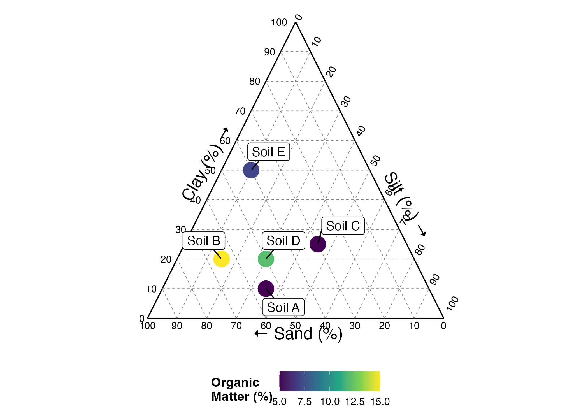

[](https://doi.org/10.5281/zenodo.10530652)

# ggsoiltexture

The goal of ggsoiltexture is to provide a simple ggplot function for the plotting of soil textural data. It is still in development, mainly for use in pubs. If you use this package please cite this repository.

# acknowledgement 
The code was development based on the ggplot_piper functions written by [Jonh Dorian](https://gist.github.com/johnDorian/5561272)

## Installation

You can install the ggsoiltexture v1.0 from [GitHub](https://github.com/Saryace/ggsoiltexture) with:

``` r
# install.packages("devtools")
devtools::install_github("Saryace/ggsoiltexture")
```

## What do you need?
Dataframe with three variables called:
- sand, as percentage
- silt, as percentage
- clay, as percentage

## More info

- Visit the [lab's YT channel](https://www.youtube.com/@laboratoriobiofisicadesuel2912)

## Main functions:

**`ggsoiltexture`**

This function plots soil texture in a ternary plot.

## Tutorial

### Data
Your data must to sum up 100%. The function will stop if it is not checked previously

``` r
library(tidyverse)
library(ggsoiltexture)
fail_data <- data.frame(
              clay = c(100,20,25,20,10),
              silt  = c(35,150,45,30,40),
              sand = c(55.65,30,0,500,50))

ggsoiltexture(fail_data)

Error in ggsoiltexture(fail_data) : 
  Some of your textural data do not sum 100%, please check.!

```


### Simple plot

A simple plot can be done directly

``` r
some_data <- data.frame(id = c("A","B","C","D","E"),
                          clay = c(10,20,25,20,10),
                          silt  = c(35,15,45,30,40),
                          sand = c(55,65,30,50,50),
                          om = c(5,15,5,12,7))

another_plot <-
ggsoiltexture(some_data)

another_plot
```


### Adding more layers

Because ggsoiltexture is based on ggplot2, more geoms, themes, can be added

``` r
pub_plot <-
    ggsoiltexture(some_data) +
    geom_point(aes(color = om), size = 6) +
    scale_color_continuous(type = "viridis") +
    labs(color = "Organic\nMatter (%)") +
    geom_label_repel(aes(label = id), box.padding = 0.5) +
    theme(legend.title = element_text(face = "bold"),
          legend.position = "bottom")

pub_plot 

```



### Adding USDA classification system

Using geom_polygon, a layer showing the USDA classes can be added

``` r
pub_plot <-
    ggsoiltexture(some_data) +
    geom_point(aes(color = om), size = 6) +
    scale_color_continuous(type = "viridis") +
    labs(color = "Organic\nMatter (%)") +
    geom_label_repel(aes(label = id), box.padding = 0.5) +
    theme(legend.title = element_text(face = "bold"),
          legend.position = "bottom")

pub_plot 

```


